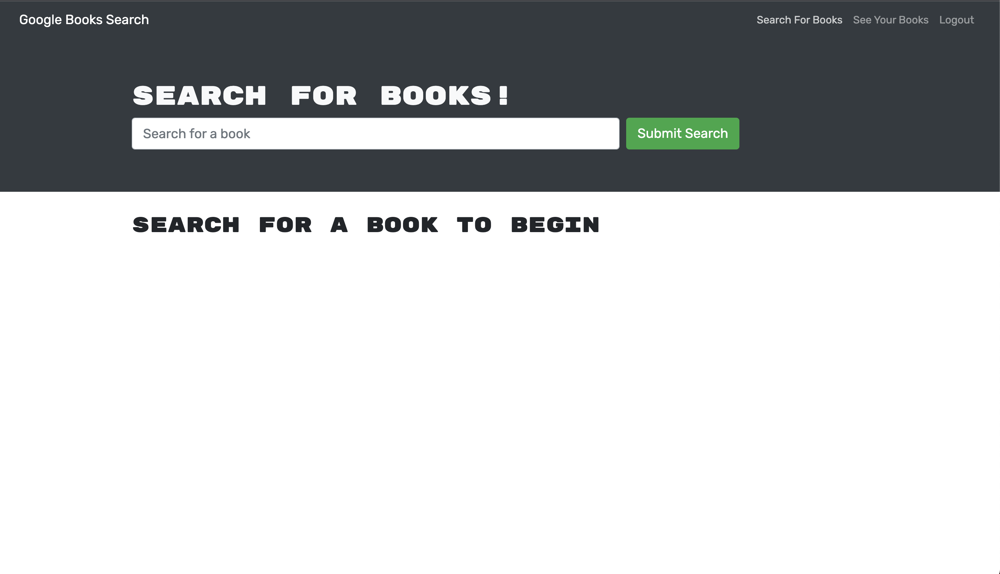
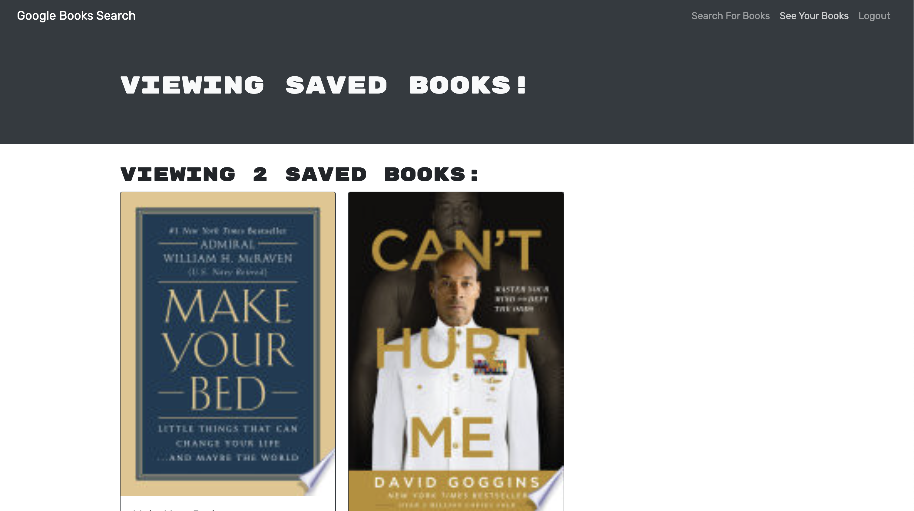

# Book-Search-Engine

## Description
My Book Library is a web application that allows users to save and manage their favorite books. It provides a user-friendly interface for users to view, add, and remove books from their library. The application is built using React, Apollo Client, GraphQL, and MongoDB.

## Deployed Site

Follow [link](https://agile-spire-25451.herokuapp.com/) to view and use my site!

## Usage

### Register and Login
Register a new user account by clicking on the "Register" button and filling out the registration form with your username and password.
Login to your account by clicking on the "Login" button and entering your username and password.

### Search and Add Books
You can search for books by title or author in the "Search Books" section.
Enter your search query in the search bar and click on the "Search" button.
The search results will be displayed as cards, showing the book title, authors, description, and book cover image.
To add a book to your library, click on the "Add to Library" button.

### Saved Books
After logging in, you can view your saved books in the "Saved Books" section.
You can see the book title, authors, description, and book cover image for each saved book.
To remove a book from your library, click on the "Delete this Book!" button.

## Technologies
- React: a JavaScript library for building user interfaces.
- Apollo Client: a fully-featured GraphQL client for React that handles data fetching and state management.
- GraphQL: a query language for your API, and a runtime for executing those queries.
- MongoDB: a popular NoSQL database for storing and retrieving data.
- Node.js: a JavaScript runtime built on Chrome's V8 JavaScript engine.
- Express: a fast, unopinionated web framework for Node.js.
- JWT: JSON Web Tokens for authentication and authorization.
- React Bootstrap: a popular UI framework for building responsive web applications.
